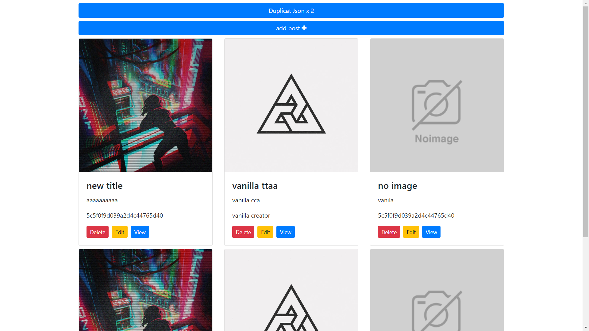

# JS Vanilla Front End
1. Requesting Data form a mongoose Api
2. Visualizing response data in a bootstrap template

## What I learned :
The difference between Using :
- the [http module in Angular](https://angular.io/api/http/HttpModule) 
- the [XML Http Request (XHR)](https://developer.mozilla.org/en-US/docs/Web/API/XMLHttpRequest/Using_XMLHttpRequest)
- the [fetch method](https://developer.mozilla.org/en-US/docs/Web/API/Fetch_API/Using_Fetch)

How to send data with the http requests Using the Fetch API
## Screenshot :

## Using : 
[live server extension in VS CODE](https://marketplace.visualstudio.com/items?itemName=ritwickdey.LiveServer).
